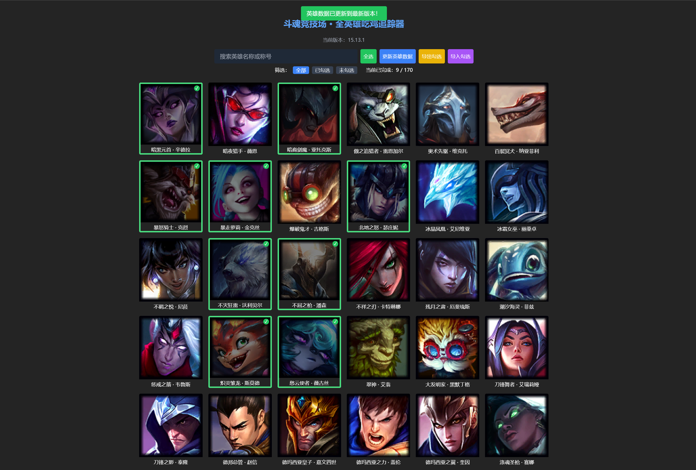

# lol-arena-achievement-tracker
### LOL 斗魂竞技场全英雄吃鸡追踪器

> 一个小工具，用来追踪你在斗魂竞技场中是否拿到过第一名。
>游戏内成就->限定成就->斗魂竞技场英雄->万变不离其宗，从中获得你已经吃鸡的英雄，自己在网页上勾选、
项目灵感就是因为游戏里面明明有成就追踪，但没有可视化的方式来查看哪些英雄已经吃鸡了，导致每次选英雄都要看图，麻烦，就搓了一个小工具出来。
---

## 🧩 项目功能

- 🎯 **成就追踪可视化**：每位英雄以头像展示，一目了然。
- 🔍 **模糊搜索支持**：支持中文名或英雄称号关键词搜索。
- ✅ **可点击勾选记录**：点击头像可切换“已完成”状态。
- ♻️ **本地持久化存储**：使用 `localStorage` 保存勾选状态。
- 📥 **导出 / 导入 JSON**：支持备份和迁移数据。
- 🔄 **版本自动同步**：可一键同步 Riot 最新英雄数据，自动保留原有勾选。
- 📊 **拼音排序 + 状态过滤**：按中文拼音排序，可过滤“已完成/未完成”。

---

## 🖼️ 项目截图



---

## 📦 技术栈

- [Vue 3](https://vuejs.org/)
- [Vite](https://vitejs.dev/)
- [Tailwind CSS 3](https://tailwindcss.com/)（注：由于兼容性原因未使用 Tailwind 4）
- Riot 官方数据接口（英雄数据与头像）

---

## 📂 使用方式

### 1. 本地运行

```bash
# 克隆项目
git clone https://github.com/yourname/lol-arena-achievement-tracker.git
cd lol-arena-achievement-tracker

# 安装依赖
pnpm install  # 或者 npm / yarn

# 启动开发服务
pnpm dev
````

访问：`http://localhost:5173`

---

### 2. 构建部署


构建完成后，会生成 `dist/` 文件夹。可以部署到：

* 本地群晖 / NAS
* GitHub Pages
* Vercel / Netlify
* 自建 Nginx / Docker 等服务

---

## 📡 数据来源说明

所有英雄数据及头像资源均来自 Riot 官方开放平台：

* 英雄数据接口：[https://ddragon.leagueoflegends.com](https://ddragon.leagueoflegends.com)
* 当前使用语言版本为：`zh_CN`

此项目不包含任何商业行为，仅供玩家个人使用。

---

## ✨ TODO（后续计划）

* ✅ 支持导出 / 导入勾选 JSON
* ✅ 支持拼音排序和筛选
* ✅ 动画过渡与勾选提示美化
* ⏳ 显示每个英雄胜率/推荐装备（扩展）
* ⏳ 自定义皮肤 UI（观感优化）

---

## 📜 License

MIT License.

---

## 💬 致谢

本项目由热爱《英雄联盟》的玩家独立开发，纯属兴趣产物。

如果你觉得这个项目对你有帮助，欢迎 🌟 Star 一下！

